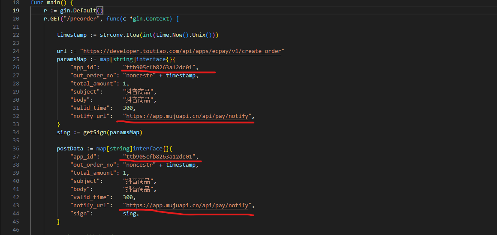
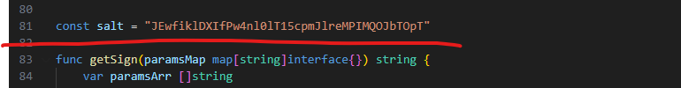

# go抖音小程序支付

#### 介绍
go抖音小程序支付

#### 使用说明

这里可以优化一下

```
               paramsMap := map[string]interface{}{
			"app_id":       "ttb905cfb8263a12dc01",
			"out_order_no": "noncestr" + timestamp,
			"total_amount": 1,
			"subject":      "抖音商品",
			"body":         "抖音商品",
			"valid_time":   300,
			"notify_url":   "https://app.mujuapi.cn/api/pay/notify",
		}
		paramsMap["sing"] = getSign(paramsMap)
```


 **替换画横线的地方，即可测试** 

